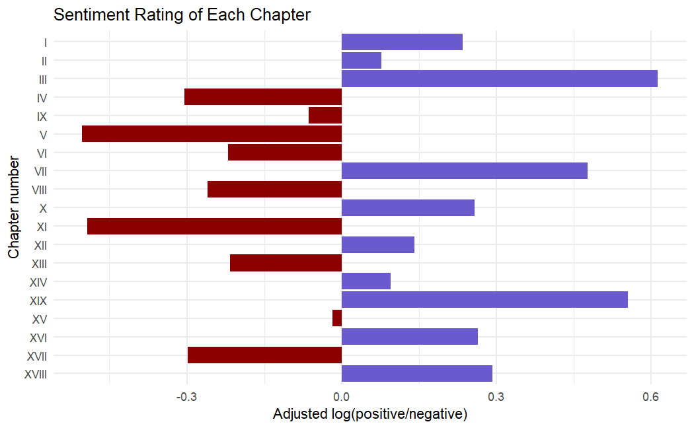
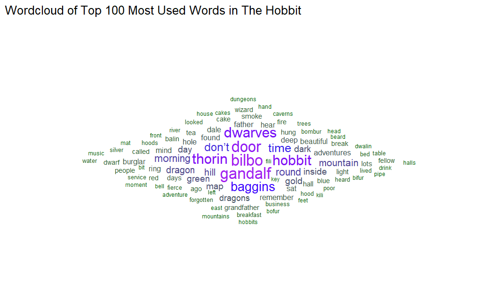

# Lab 9: Text Analysis

This lab was a learning module as part of the ESM 244 course in Advanced Data Analysis Methods.

**What I learned, and the type of analysis I can quickly support:**
- **Language**: R
- **Data Analysis Methods:** Text analysis
- **Other Activities:** Text Analysis [textdata](https://cran.r-project.org/web/packages/textdata/index.html)), Reading in PDFs ([pdftools](https://cran.r-project.org/web/packages/pdftools/index.html)), Creating Wordclouds ([ggwordcloud](https://cran.r-project.org/web/packages/ggwordcloud/index.html)).

### Wordcloud of frequently used words in the Hobbit (by JRR Tolkien)

*Note: Github is hiding the title for the wordcloud, which is also in the image itself (you can view this by clicking on the image).
